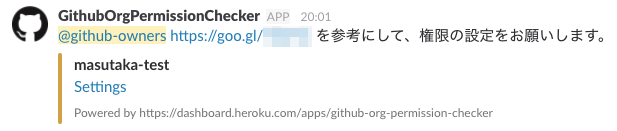
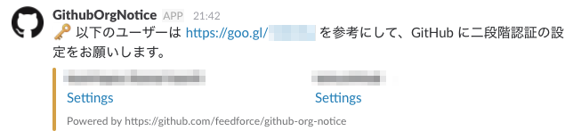

# github-org-notice

Check the following of GitHub organization and notify to Slack.

* Repository permissions

    

* 2FA disabled users

    

## Setup

1. Click 
1. Open Heroku scheduler `ex. $ heroku addons:open scheduler --app <App Name>`
1. Add command to Heroku scheduler
   * `$ bundle exec ruby permission.rb`
   * `$ bundle exec ruby tfa.rb`
