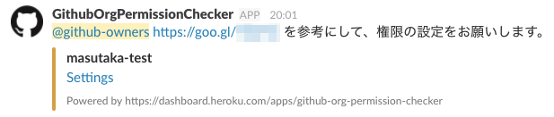

# github-org-notice

Check GitHub organization permissions and notify to Slack.

## Setup

1. Click 
1. Open Heroku scheduler `ex. $ heroku addons:open scheduler --app <App Name>`
1. Add command to Heroku scheduler
   * `$ bundle exec ruby permission.rb`
